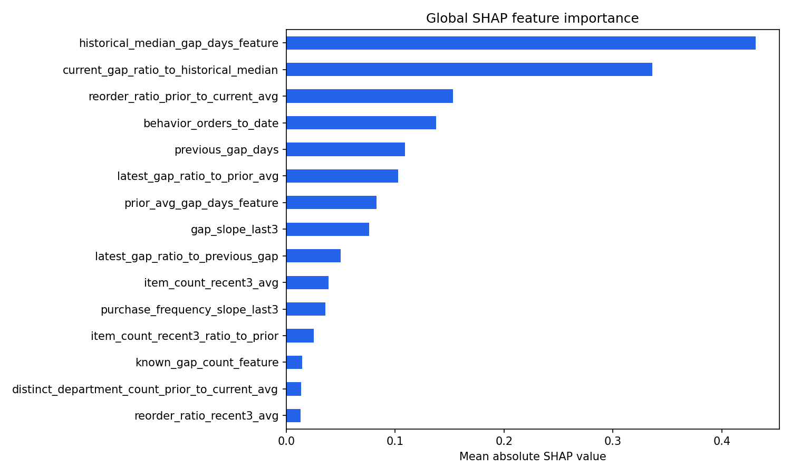

# Purchase Pattern Decay Analysis

A deployable machine-learning case study that identifies Instacart users whose next purchase gap may exceed twice their historical median gap. It combines an XGBoost scoring pipeline, explainability artifacts, a read-only Python API, and a responsive React dashboard.

Built as a collaboration between Siddharth R and Shreya B.N.

This project is deliberately **not presented as a calibrated churn predictor**. The dataset has no global calendar dates, purchase gaps are capped at 30 days, and the score is not a probability. The defensible claim is narrower: purchase-rhythm decay can be ranked as an early operational warning signal.

## Live demo

**[Open the deployed dashboard](https://purchase-pattern-analysis.onrender.com/)**

[View the v1.0.0 deployment release](https://github.com/Speaksid153/purchase-pattern-decay-analysis/releases/tag/v1.0.0). The free Render instance sleeps after inactivity, so its first load can take roughly a minute.

## Model evidence

The deployed model was selected across two rolling user-lifecycle development folds, retrained on all development rows, and evaluated once on the untouched final 15% user cohort:

- Row ROC-AUC: `0.6640` (previously `0.6607`)
- Row PR-AUC: `0.2637` (previously `0.2585`)
- Latest-customer ROC-AUC: `0.6707` (previously `0.6604`)
- Latest-customer PR-AUC: `0.2750` (previously `0.2650`)
- Rolling-development action cutoff: `0.5836`
- Precision / recall at that cutoff: `36.01%` / `13.81%`
- Median lead time among correctly flagged positive-event users: `12.0` days

This is a measured improvement, not a breakthrough: the row-level ROC-AUC gain is `0.0034`, while the larger `0.0103` gain appears at the latest-customer decision point. More complex feature and weighting variants were tested and rejected when they failed to generalize better across rolling folds.

The dashboard applies operational bands to the model score: High (`>= 0.70`), Medium (`>= 0.45 and < 0.70`), and Low (`< 0.45`). These bands support segmentation and intervention analysis; they are not probability thresholds. The deployed cohort contains 25,718 held-out users: 295 High, 3,973 Medium, and 21,450 Low.



## What is included

- React 19 and TypeScript dashboard with search, filtering, pagination, customer evidence, dark mode, responsive layouts, and explicit API failure states.
- Python read-only API backed by precomputed, indexed SQLite serving caches.
- Nine self-contained, fully executed notebooks covering validation, EDA, labeling, feature engineering, modeling, temporal-robustness experiments, and SHAP analysis.
- Multi-stage Docker builds for local Compose and a single-container public portfolio deployment.
- CI checks for TypeScript, production bundling, API contracts, notebook parsing, Python compilation, and the deployment image.
- Artifact checksums and a verified compact release-bundle workflow; raw data and large model outputs stay out of Git.

## Repository guide

- [`src/`](src/) contains the production React dashboard and analytical insight rules.
- [`notebooks/`](notebooks/) contains the canonical nine-stage analytical workflow with retained outputs and rendered evidence.
- [`scripts/`](scripts/) contains only production support code: the API, serving-cache packaging, verification, and benchmarking utilities.
- [`reports/project_validation_summary.md`](reports/project_validation_summary.md) summarizes the end-to-end validation evidence.
- [`reports/modeling/instacart/phase4_leading_xgboost_report.md`](reports/modeling/instacart/phase4_leading_xgboost_report.md) documents the deployed model and its limitations.
- [`reports/modeling/instacart/temporal_robustness_report.md`](reports/modeling/instacart/temporal_robustness_report.md) records every development candidate and the honest pre/post comparison.
- [`deployment/`](deployment/) contains the public and self-hosted deployment runbooks.
- [`tests/`](tests/) verifies API contracts and secure serving-bundle installation.

## Local development

Use Python 3.14.x and Node.js 22.12+.

```powershell
py -m pip install -r requirements.txt
npm ci
py scripts/api_server.py
```

In a second terminal:

```powershell
npm run dev
```

Open `http://127.0.0.1:5173`. On macOS or Linux, replace `py` with `python3`.

For analytical reproduction, open the notebooks in numeric order after placing the Instacart CSVs under `data/instacart/`. Every committed notebook has already been executed against the full dataset, so its outputs are visible directly on GitHub.

## Verification

```powershell
npm run check
py scripts/verify_serving_cache.py
```

`npm run check` runs TypeScript checking, the production build, and self-contained API-contract tests. The full cache verifier compares all 25,718 served scores and risk bands with the offline artifacts, exercises sorting and filtering, checks complete detail payloads, and confirms deployed metrics.

## Public deployment

The portfolio configuration targets a free Render web service. The browser sees one HTTPS origin; Nginx serves the built dashboard, rate-limits and proxies `/api`, and the Python API listens only inside the container.

Create the verified serving bundle with:

```powershell
py scripts/package_serving_cache.py
```

Upload `deployment/releases/serving-cache-v2-robust.zip` as a versioned GitHub Release asset, then connect the repository as a Render Blueprint and provide:

- `SERVING_BUNDLE_URL`: the asset's direct HTTPS download URL.
- `SERVING_BUNDLE_SHA256`: the checksum printed by the packaging command.

The container downloads only the three runtime files, verifies the bundle and every internal file before boot, and fails closed on any mismatch. See the [deployment runbook](deployment/README.md) for the complete process and the separate Docker Compose path.

Render's free service is suitable for a resume demo, not an always-on production workload. Upgrade to an always-on instance if cold-start delays become unacceptable.

## Data and limitations

The project uses the anonymized Instacart Market Basket Analysis data published for [Kaggle's 2017 competition](https://www.kaggle.com/c/basket-analysis/overview). Customer IDs are dataset identifiers, not real customer identities. Raw data is not committed. The runtime cache contains only derived scores, aggregate behavior, explanation payloads, and model metrics required by the demo.

Key limitations:

- Relative user lifecycle time is a proxy, not calendar-time validation.
- The target measures unusually long next-order gaps, not permanent customer loss.
- Results show ranking utility, not causal impact or intervention lift.
- The model is appropriate for portfolio and decision-support demonstration, not autonomous customer treatment.

## License

Original project code is released under the [MIT License](LICENSE). Dataset and dependency terms are described in [THIRD_PARTY_NOTICES.md](THIRD_PARTY_NOTICES.md).
